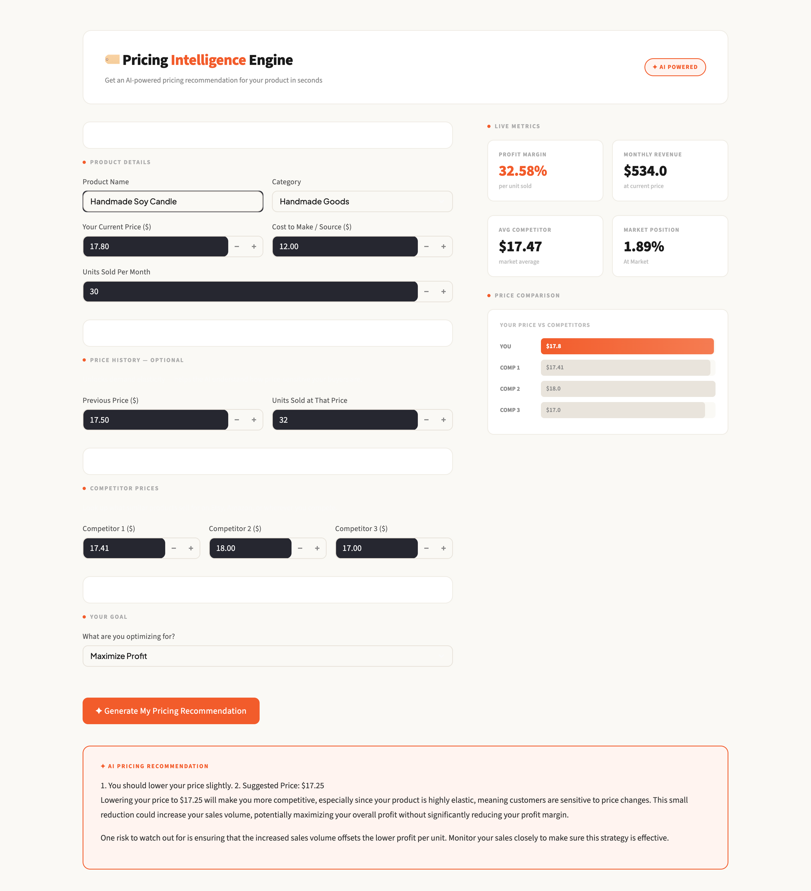

# 🏷️ Pricing Intelligence Engine
By Allan Gikonyo, 2026

## Description
This tool helps small business owners and independent sellers set the right price by analyzing costs, competitors, and market dynamics. Get instant, data-backed recommendations that balance profitability, demand, and positioning. Powered by OpenAI.



## Setup
**Prerequisites:** Python 3.11+, Open AI API key

```bash
git clone https://github.com/Allangikonyo/Pricing-Engine.git
cd pricing-engine

arch -arm64 python3 -m venv venv   # Apple Silicon
source venv/bin/activate
pip install streamlit openai python-dotenv
```

Add a `.env` file:
```
OPEN_AI_API_KEY=your_key_here
```

Run:
```bash
streamlit run app.py
```

## Technologies Used
Python, Streamlit, Open AI API, python-dotenv

## Known Bugs
None.
